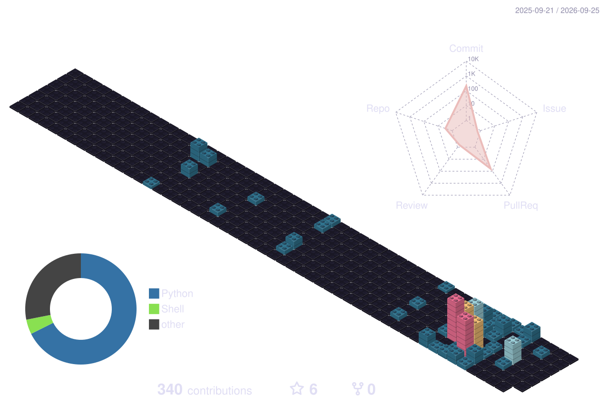

### Hi there 👋, I'm Mahhan.

## About Me:
I am a student at the University of Central Oklahoma studying Computer Engineering. 
- Currently co-developing a unique video game project [@Whalefall-Software](https://github.com/Whalefall-Software).
## Skills:

### Languages:

### Tools:

## Socials:
  

## Github Stats:

